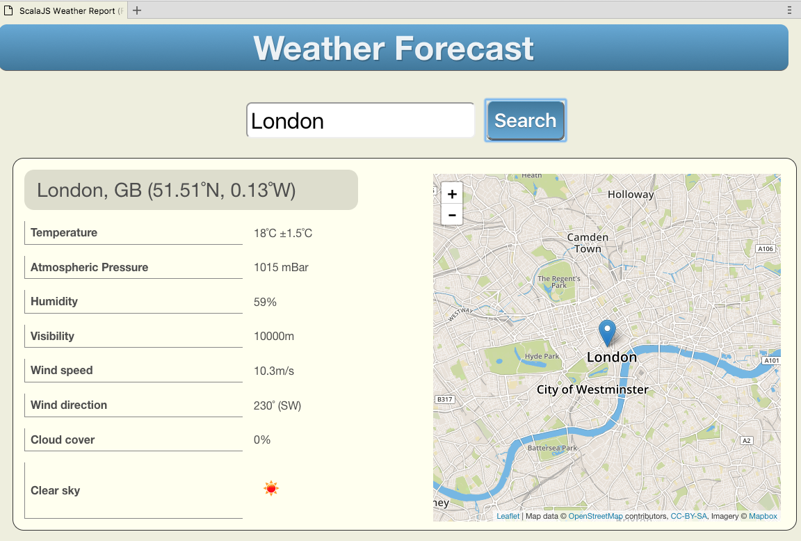

# Weather Report App based on ScalaJS



This weather report application accesses OpenWeatherMap.org to obtain the current weather information for whatever city (or cities) match your input value.

# Setup Instructions

1. Clone this repo
1. Set up your own API Key for OpenWeatherMap.org and add this value into the source code of `Utils.scala`. (See instructions below)
1. Recompile the app using both `fastOptJS` and `fullOptJS`.
1. In `manifest.yml`:
    1. Edit the `host` value to point to a suitable virtual hostname for this app.  For instance, add your userid to the front of `-weather-report`.
    1. Edit the `domain` value to point to the data centre in which your account is located
    1. Edit the end of the `TENANT_HOST_PATTERN` value to match the domain name of your data centre
1. From the command line, change into the directory containing the `manifest.yml` file
1. `cf login` to your Cloud Foundry account
1. `cf push` the app to Cloud Foundry
1. In your browser, run the app by visiting the webiste formed by joining the `host` dot `domain` values found in `manifest.yml`

## Setting Up Your Own API Key in OpenWeatherMap.org
All API requests to OpenWeatherMap.org must contain an API Key.  Without such a key, your HTTP request will return `HTTP 401 Not Authorised`.

1. Set up a free account with [OpenWeatherMap.org](https://home.openweathermap.org/users/sign_up)
1. Once you have an account, create your own API Key.
1. Paste your API Key into the empty string defined as the value of key "apikey" in the map object `owmQueryParams` (line 35 of `Utils.scala`).

    ```scala
      var owmQueryParams = scala.collection.mutable.Map(
         "q"      -> ""
        ,"type"   -> "like"
        ,"mode"   -> "json"
        ,"apikey" -> "<Paste your API Key value here>"
      )
    ```

   
   

