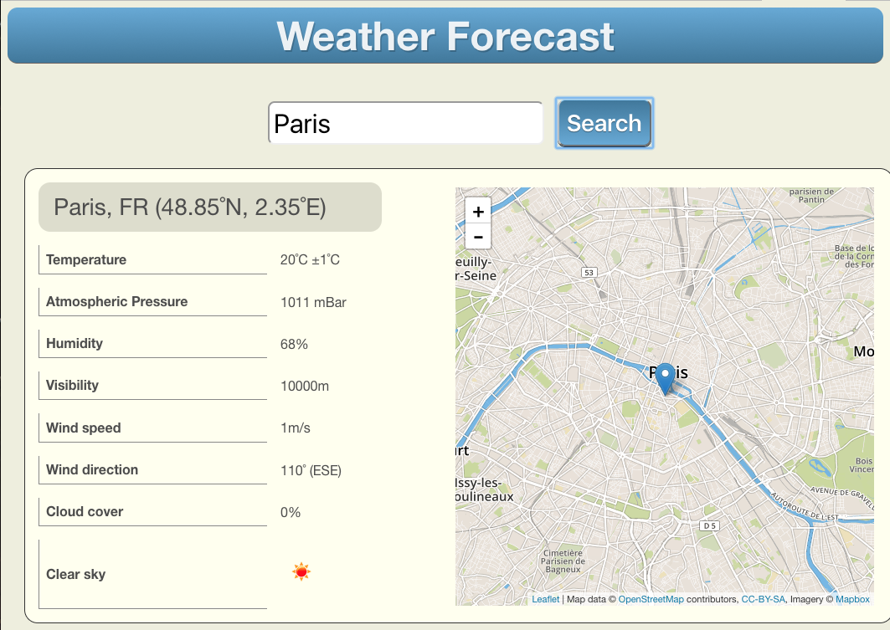

# Weather Report App based on ScalaJS



This weather report application accesses [Open Weather Map](OpenWeatherMap.org) to obtain the current weather information for whatever city (or cities) match your input value.

# Assumptions

1. In order to implement this app, you must have a working Scala development environment installed on your machine.  The exact IDE you use is not important, but it is important that `sbt` is used to build Scala applications.

1. In order to publish this app to Cloud Foundry, it is assumed that you already have an account on the one of the SAP Cloud Foundry trial systems.

    If this is not the case, then please visit <https://account.hanatrial.ondemand.com> and click on the button labelled "Go to Cloud Foundry Trial".  This will set up a new account for you and then take you the dashboard for that new account.  Please make a note of the data centre in which your account has been created.

    

# Setup Instructions

1. Clone this GIT repo into a suitable working directory on your machine
1. Set up your own API Key for OpenWeatherMap.org and add this value into the source code of `Utils.scala` (See instructions below)
1. Use `sbt` to recompile the app using the option `fullOptJS`.  This is because the `target/xs-app.json` points to the fully optimised version of the generated Scala.Js coding
1. In `manifest.yml`:
    1. Edit the `host` value to point to a suitable virtual hostname for this app.  This name must be globally unique, so the easiest way to create such a hostname is to prefix your desired name with your userid.
    1. The `domain` value has been preconfigured to point to Europe (Frankfurt) Cloud Foundry system; however, this may need to be altered depending on the data centre in which your account exists.  
    You can find your own CF domain name from the command line by first logging in to CF using `cf login`, then entering the command `cf domains`.  If your account exists in the Europe (Frankfurt) data centre, then you will not need to change the domain name.
    1. The last part of the domain name used in the `TENANT_HOST_PATTERN` value must match the domain name used in the `domain` field.
1. From the command line, change into the `target` directory of this repo
1. Even if you are connected to the corporate network, configure `npm` ***not*** to use a proxy server.  If you don't do this, `npm` will be unable to reach SAP's Nexus server and the following `npm install` command will probably hang.
    * This is done by issuing the commands `npm config delete proxy` and `npm config delete https-proxy`
    * To switch `npm` proxy configuration back on, issue the commands `npm config set proxy http://proxy:8080` and `npm config set https-proxy http://proxy:8080` 
1. Run `npm install` to install the required node modules into the target directory
1. Change up one level (`cd ..`) into the directory containing the `manifest.yml` file
1. `cf login` to your Cloud Foundry account
1. `cf push` the app to Cloud Foundry.
1. Once the push to Cloud Foundry has completed, the URL of the deployed app will be displayed.  In your browser, run the app by visiting this URL.

---

## Setting Up Your Own API Key in OpenWeatherMap.org
All API requests to OpenWeatherMap.org must contain an API Key.  Without such a key, your HTTP request will return `HTTP 401 Not Authorised`.

1. Set up a free account with [OpenWeatherMap.org](https://home.openweathermap.org/users/sign_up)
1. Once you have an account, create your own API Key.
1. Paste your API Key into the empty string defined as the value of key "apikey" in the map object `owmQueryParams` (line 35 of `Utils.scala`).

    ```scala
      var owmQueryParams = scala.collection.mutable.Map(
         "q"      -> ""
        ,"type"   -> "like"
        ,"mode"   -> "json"
        ,"apikey" -> "<Paste your API Key value here>"
      )
    ```

## Behaviour of OpenWeatherMap Queries

When a query is sent to OpenWeatherMap to find all cities whose names match a certain string, then sometimes you will get some strange results coming back.

For instance, if you search for "**London**", the first request will not be sent until you have entered at least 4 characters - "lond".  At this point (and for reasons I cannot explain), OpenWeatherMap thinks that a place called Etu-Töölö, outside Helsinki, Finland is an accurate match for "lond"!

However, as soon as you add a fifth character to the search string "londo", then you start to see cities that really match this string.

During the development process, I contacted the support team at OpenWeatherMap about this, and they said "**Oh yes, it does that sometimes**"...

Not much we can do about that then...


